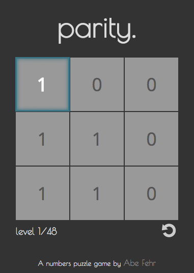

Yesh Parity
======

Parity is a simple numbers puzzle game written in Javascript. 

  

How to play
===========

The game is played by moving a cursor around the board to select different squares in a grid. Each time you select a select a cell by moving the cursor with the arrow keys, the number inside that cell increases by one.

The goal of the game is to make each number on the board equal.

